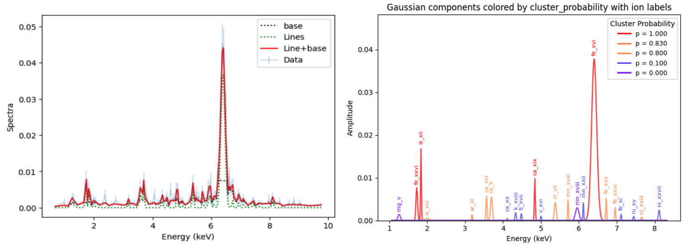

# Summary

BLiSS, the Blind Line Search System, is a modular Python package for the automated detection, characterization, ranking, and optional identification of emission-line candidates in astronomical spectra. The package was developed with X-ray spectroscopy in mind, but its core algorithms operate on generic one-dimensional spectra represented by energy, flux or counts, and uncertainty arrays. BLiSS is designed for exploratory spectral analysis, where the objective is to identify candidate emission structures before committing to a detailed physical continuum model.

Emission-line analysis is central to high-energy astrophysics. Line centroids, widths, intensities, and ratios encode information about chemical composition, ionization state, plasma temperature, density, velocity fields, and geometry. In X-ray binaries and other accreting systems, emission lines can trace photoionized winds, accretion flows, shocked material, and reprocessing regions. The arrival of high-resolution X-ray missions such as XRISM [@2022arXiv220205399X] and NewAthena [@2016SPIE.9905E.2FB] will increase the need for reproducible and automated line-search tools. Manual inspection of residuals remains useful, but it is not scalable for large datasets, repeated simulations, or homogeneous analyses across source samples.

BLiSS addresses this need by providing a blind, continuum-independent candidate-detection workflow. Instead of requiring a predefined global continuum model, BLiSS estimates empirical local baselines directly from the input spectrum, detects positive excess structures, characterizes them with Gaussian models, and evaluates their reliability using synthetic comparison populations and Gaussian Mixture Models. Optional atomic-line identification routines can then match fitted centroids against transition tables within user-defined Doppler windows.

# Statement of need

Several mature tools already exist for astronomical spectral analysis. XSPEC [@1996ASPC..101...17A], SPEX [@kaastra1996uv], ISIS [@2013ascl.soft02002H], and Sherpa [@2001SPIE.4477...76F] provide powerful environments for instrument-aware fitting and physical plasma modelling. These packages are essential for final quantitative interpretation. However, they are primarily designed around explicit spectral models and user-specified fitting components, rather than blind candidate discovery.

Python packages such as Specutils [@specutils] and LiMe [@lime] provide valuable tools for representing, fitting, and measuring spectral lines. Other software, such as PyEMILI [@2025ApJS..277...13T], focuses on automatic identification of spectral lines using atomic databases and ranking criteria. BLiSS fills a complementary niche. It is not intended to replace physical spectral modelling packages, nor to provide a final plasma-diagnostic solution. Instead, it provides a reproducible discovery layer: a way to find, rank, and describe candidate emission features before deciding which continuum or model should be used for detailed interpretation.

This design is particularly useful in cases where the continuum is complex, uncertain, or locally structured. In many high-energy spectra, a global continuum fit can depend on model assumptions, absorption prescriptions, instrumental choices, or selected energy ranges. BLiSS therefore separates the exploratory detection stage from the final modelling stage. The output catalogue can later be used to guide XSPEC, ISIS, SPEX, Sherpa, or custom fitting workflows.

# Methodology

The first stage of the BLiSS workflow is empirical baseline estimation. BLiSS does not interpret this baseline as a physical continuum. Instead, it acts as a numerical approximation to the local spectral floor.

Positive structures in the excess spectrum are interpreted as candidate emission-line regions or blocks. Within each candidate block, BLiSS identifies local maxima using peak-finding routines. For each peak, the package estimates quantities such as prominence, width, local height, and separation from neighboring peaks. Configurable filters can then be applied, including minimum prominence, minimum separation, width consistency, and maximum peak density. This workflow allows to identifly multiple line components, close in emisison energy when the resolution is sufficient.

Detected structures are characterized with Gaussian models. Multi-peak regions are represented as sums of Gaussian components. Initial parameter estimates are obtained automatically from the peak-detection stage, and fits are performed with nonlinear least-squares optimization. For each candidate, BLiSS reports centroid energy, width, amplitude, uncertainties, local noise estimates, signal-to-noise ratio, equivalent width, line area, and relative-excess metrics.

A distinctive feature of BLiSS is the construction of synthetic comparison populations. Synthetic spectra are generated by reshuffling residual or excess structures while approximately preserving the statistical properties of the original spectrum. The same detection pipeline is then applied to the real and synthetic spectra. This produces two candidate populations: one extracted from the observed spectrum, and one representing noise-like or reshuffled structures.

BLiSS combines real and synthetic candidates in a multidimensional feature space, using quantities such as Gaussian amplitude, width, signal-to-noise ratio, local contrast, and width-to-amplitude ratio. These features are standardized before Gaussian Mixture Models are fitted. The number of GMM components is selected using the Bayesian Information Criterion. For each cluster, BLiSS estimates the probability that its candidates are real emission-line candidates rather than artifacts, based on the relative number of real and synthetic features assigned to that cluster.

This cluster-based score is not a formal Bayesian posterior probability. Rather, it is an empirical reliability score that quantifies how strongly a candidate resembles the real-detection population rather than the synthetic comparison population.

A integration with ISIS is also provided: it directly adds gaussian emission lines to a chosen continuum.

# Atomic-line identification

BLiSS includes optional routines for matching fitted centroids against XSTAR atomic transition tables. For each observed candidate energy the package searches for transitions satisfying a user-defined Doppler compatibility condition.

Compatible transitions can then be ranked using atomic-prior scores based on quantities such as elemental abundance weights and Einstein coefficients from XSTAR-related atomic data [@Bautista_2001a]. This ranking is intended as a heuristic guide, not as a physical prediction of line flux. The identification stage remains independent from the blind-search stage, so users may perform candidate detection without adopting any specific atomic interpretation.

# Applications

This code, now structured and collected in a package had been succesfully used in published papers, and under review.

# Acknowledgements

This research has been funded by the ASFAE/2022/02 project from the Generalitat Valenciana.
